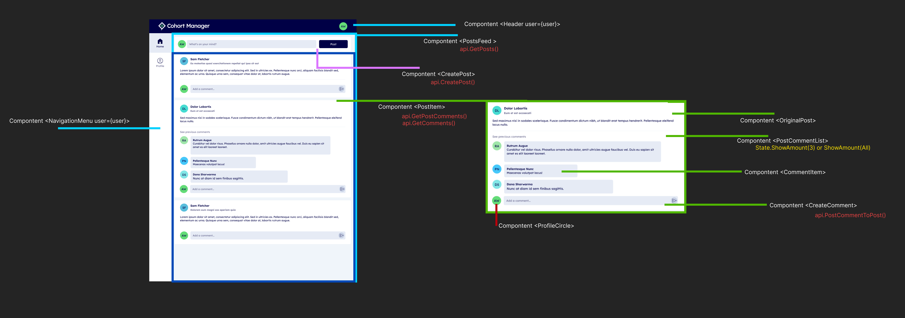

# Cohort Manager Application Structure

- Component `<NavigationMenu>`
- Component `<Header user={user}>`
- Component `<PostsFeed>`

  - `api.GetPosts()` is fetched to render **\<PostItem>** s
  - _Will be wrapped in a provider to make data accessible through out application_
  - Component `<CreatePost>`
    - `api.CreatePost()`
  - _several_ Component `<PostItem>`
    - `api.GetPostComments()`

  ***

  A `<PostItem>`contains the following:

  - `PostItem`
    - Component `<OriginalPost>`
    - Component `<PostCommentList>`
      - `State.ShowAmount(3)` or `ShowAmount(All)`
    - Component `<CommentItem>`
    - Component `<CreateComment>`
      - `api.PostCommentToPost()`

---

Standalone Reusable component

- Component `<ProfileCircle>`
