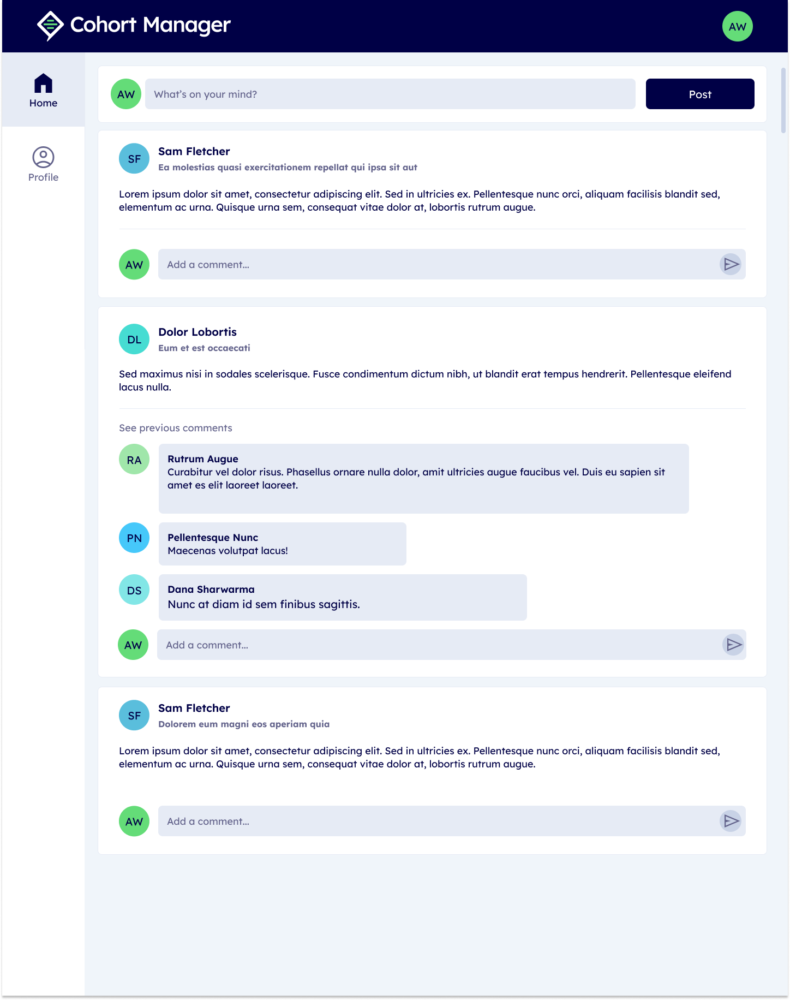
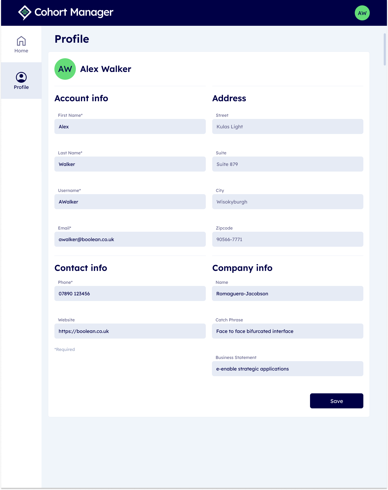

# Plan

## Goals

1. Make this page:
   
2. And this page:
   
## Components

- [ ] `<App />`
	- [ ] `<Header />`
		- [ ] `<WebsiteTitle />`
		- [ ] `<UserIcon />`
	- [ ] `<SideMenu />`
		- [ ] `SIDE_MENU_ITEMS.map()` => `<SideMenuItem />`
	- [ ] `<Routes />`
		- [ ] `<Route />` => `<Home />`
			- [ ] `<NewPost />`
				- [ ] `<UserIcon />`
				- [ ] `<NewPostForm />`
					- [ ] `<TextInput />`
					- [ ] `<SubmitButton />`
			- [ ] `<PostFeed />`
				- [ ] `feed.map()` => `<PostItem />`
					- [ ] `<PostHeader />`
						- [ ] `<UserIcon />`
						- [ ] `<UserName />`
						- [ ] `<PostTitle />`
					- [ ] `<PostBody />`
					- [ ] `<PostCommentFeed />`
						- [ ] `<PreviousComments />`
						- [ ] `postCommentFeed.map()` => `<Comment />`
							- [ ] `<UserIcon />`
							- [ ] `<CommentBody />`
								- [ ] `<UserName />`
								- [ ] `<CommentContent />`
						- [ ] `<NewComment />`
							- [ ] `<UserIcon />`
							- [ ] `<NewCommentForm />`
								- [ ] `<TextInput />`
									- [ ] `<NewCommentButton />`
			- [ ] `<PostSingle />`
				- [ ] `<PostItem />`
					- [ ] ... All components in `<PostItem />`
	- [ ] `<Route />` =>  `<Profile />`
		- [ ] `<h2 />`
		- [ ] `<ProfileForm />`
			- [ ] `<ProfileTitle />`
				- [ ] `<UserIcon />`
				- [ ] `<UserName />`
			- [ ] `PROFILE_FORM_TEMPLATE.map()` => `<ProfileFormSection />`
				- [ ] `<ProfileFormSectionTitle />`
				- [ ] `PROFILE_FORM_TEMPLATE.section.fields.map()` => `<ProfileFormField />`
					- [ ] `<ProfileFormFieldTitle />`
					- [ ] `<TextInput />`
				- [ ] `<SubmitButton />`
## State

- `<App />`
	- `const loggedInUser: number = 1`
	- `const activePage: string = "Home"`
- `<NewPostForm />`
	- `const text: string = "blah blah blah"`
- `<PostFeed />`
	- `const feed: array = [{}, {}, ...]`
- `<PostItem />`
	- `const postId: number = 1`
	- `const edited: boolean = false`
	- `const belongsToLoggedUser: boolean = true`
	- `const commentFeed: array = []`
	- `const bigCommentFeed: boolean = false`
	- `const showAllComments: boolean = true`
- `<Comment />` 
	- `const commentId: number = 1`
	- `const belongsToLoggedUser: boolean = true`
	- `const deleted: boolean = false`
	- `const edited: boolean = false`
- `<NewCommentForm />`
	- `const text: string = "blah blah blah"`
- `<Profile />`
	- `const userId: number = 1`
	- `const isLoggedInUser: boolean = true`
	- 